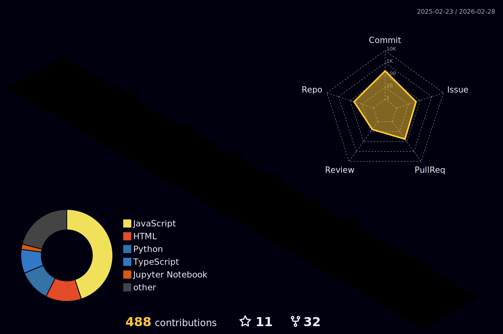

<!-- HERO: THIS IS FINE GIF (GIPHY SOURCE) -->

  

<!-- TYPING HEADER -->

<!-- SOCIAL BADGES -->

  
  

<!-- VISITOR COUNT -->

 

<!-- SECTION: ABOUT ME -->

> **Alert:** *"I don't always test my code, but when I do, I do it in production."*

I am a **Full Stack Developer** who thrives in chaos. My specialty is building robust systems that (usually) don't catch fire.

 **Breaking monolithic architectures into microservices.**  
 **Learning Cloud Security to fix what I break.**  
 **I once deleted a database, and I'll do it again.**

 

<!-- SECTION: TECH STACK -->

| **Category** | **Arsenal** |
| :--- | :--- |
| **The Fuel** |    |
| **The Spark** |    |
| **The Explosion** |    |
| **Extinguishers** |    |

 

<!-- SECTION: PROJECTS -->

| **Project** | **Status** | **Tech Used** |
| :--- | :--- | :--- |
| **AlgoFi** |  | `JS` `React` |
| **DENAI** |  | `Python` `AI` |
| **hackVerse** |  | `TypeScript` |
| **poketonn** |  | `JavaScript` |
| **Lexi** |  | `Python` `NLP` |

 

<!-- SECTION: STATS -->

  <!-- STREAK STATS -->
  
  
   
  
  <!-- ACTIVITY GRAPH -->
  

 

<!-- SECTION: 3D CITY -->

  <!-- Make sure the workflow has run for this image to appear -->
  

---

  
   
  <i>"It works on my machine."</i>

